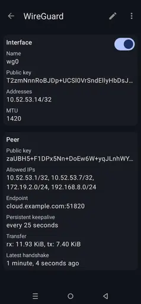

# WireGuard Unlocked (Part 1): Your LAN, Anywhere — The Easy Setup

WireGuard really surprised me. It seemed like just another VPN at first, but under the hood, it follows a minimal and highly efficient design. By doing less, it achieves more speed, security, and reliability without the usual VPN complexity.

Still, many people struggle with things like peer setup, `AllowedIPs`, NAT or routing logic. So I’m starting this series with the most common use case: securely accessing your home or office LAN from a mobile phone or laptop.

## Topology Overview


We have three devices in this setup:

- **VPN Server** — Acts as the central relay with a public IP. It listens for incoming WireGuard connections from clients.
- **VPN Client (Ubuntu)** — Connects to the server to access the server-side LAN. It also exposes its own LAN to the server and other peers.
- **VPN Client (Android)** — Runs the official WireGuard app. It connects to the server and can access both the client’s and server’s LANs.

All devices share the same WireGuard subnet: `10.52.53.0/24`.

- The server uses a `/24` mask because it communicates with multiple clients.
- Clients use `/32` masks since they only need to route their own traffic through the tunnel.

## Installing WireGuard

Before we configure anything, let’s install WireGuard on both the Ubuntu server and Ubuntu client:

```bash
sudo apt install wireguard
```

## Generating Keys

WireGuard is based on public-key cryptography. Each device must have its own key pair — one private key (kept secret) and one public key (shared with peers).

To generate a key pair:

```bash
wg genkey | tee privatekey | wg pubkey > publickey
```

Or use these quick one-liners for each device:

```bash
PRIV=$(wg genkey); PUB=$(echo "$PRIV" | wg pubkey); echo "Server PrivateKey: $PRIV"; echo "Server PublicKey: $PUB"
PRIV=$(wg genkey); PUB=$(echo "$PRIV" | wg pubkey); echo "Client PrivateKey: $PRIV"; echo "Client PublicKey: $PUB"
PRIV=$(wg genkey); PUB=$(echo "$PRIV" | wg pubkey); echo "Mobile PrivateKey: $PRIV"; echo "Mobile PublicKey: $PUB"
```

## WireGuard Config File (`/etc/wireguard/wg0.conf`)

The WireGuard configuration file is divided into two main parts:

### Interface Section

Defines local settings for the `wg0` interface. At minimum, specify:

- `PrivateKey` — your device’s private key
- `Address` — the IP address for the WireGuard interface
- `MTU` — optional but recommended to prevent fragmentation (e.g., 1420)
- `ListenPort` — required for servers (e.g., 51820)

### Peer Section

Defines each remote peer and how to reach them. For each peer, specify:

- `PublicKey` — the peer’s public key
- `Endpoint` — the public IP and port of the peer (required on clients)
- `AllowedIPs` — IP ranges routed via the peer
- `PersistentKeepalive` — optional but recommended on clients behind NAT

### Server Configuration

Edit the file `/etc/wireguard/wg0.conf`:

```ini
[Interface]
PrivateKey = aEqKT6yuAYFrSuo7/gc2aVho6E63zURd7BSn7WtdCXQ=
Address = 10.52.53.1/24
MTU = 1420
ListenPort = 51820

# Ubuntu Client
[Peer]
PublicKey = 1eNRuE3LZekFTcXCCHoFyHxFUkmDRl+8XCLR6J1YV3s=
AllowedIPs = 10.52.53.7/32, 192.168.8.0/24

# Android Client
[Peer]
PublicKey = T2zmNnnRoBJDp+UCSl0VrSndEllyHbDsJNIXFuFJgQU=
AllowedIPs = 10.52.53.14/32
```

Enable IP forwarding:

```bash
sudo sysctl -w net.ipv4.ip_forward=1
```

Then enable and start WireGuard:

```bash
sudo systemctl enable wg-quick@wg0 --now
```

### Client Configuration

Edit `/etc/wireguard/wg0.conf`:

```ini
[Interface]
PrivateKey = 2Hif9GUJwZEWpH6eLTc0fchdAvqHF5/JaMvjxg/1rWM=
Address = 10.52.53.7/32
MTU = 1420

[Peer]
PublicKey = zaUBH5+F1DPx5Nn+DoEw6W+yqJLnhWYN7pElxzbi0Xc=
Endpoint = <server-ip>:51820
AllowedIPs = 10.52.53.1/32, 10.52.53.14/32, 172.19.2.0/24
PersistentKeepalive = 25
```

Then enable and start WireGuard:

```bash
sudo systemctl enable wg-quick@wg0 --now
```

### Mobile Configuration

Install the official WireGuard app from the Play Store.  
Tap the ➕ button to add a new tunnel manually:

```ini
[Interface]
PrivateKey = 0N65LkXXXfmyceCqzP7X/0Yy2tldBywaDdU6ox2BFVM=
Address = 10.52.53.14/32
MTU = 1420

[Peer]
PublicKey = zaUBH5+F1DPx5Nn+DoEw6W+yqJLnhWYN7pElxzbi0Xc=
Endpoint = <server-ip>:51820
AllowedIPs = 10.52.53.1/32, 10.52.53.7/32, 172.19.2.0/24, 192.168.8.0/24
PersistentKeepalive = 25
```

This is how the VPN looks in the mobile app:  


## Verification & Testing

Once all devices are configured and connected:

From the **Server**:

```bash
ping 10.52.53.7
ping 10.52.53.14
ping 192.168.8.1
```

From the **Client**:

```bash
ping 172.19.2.1 
ping 10.52.53.14
```

## Wrapping Up

This guide walked you through a step-by-step setup of WireGuard — from generating keys to full configuration across a server, client, and mobile device. In the next post, I’ll dive deeper into how WireGuard handles routing, peer discovery, and the magic behind `AllowedIPs`.

For now, just follow the instructions as shown — and keep in mind, you don’t need a cloud VPS to try this. All three devices can be on the same network, like your home LAN. It’s a great way to get comfortable with the setup before going remote.