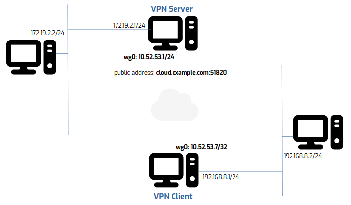

# WireGuard Unlocked (Part 2): Deep Dive into AllowedIPs  

WireGuard doesn’t rely on routing daemons, ARP broadcasts, or complex protocol stacks. Instead, a single configuration setting — **`AllowedIPs`** — governs both the traffic that enters the tunnel and the traffic that’s accepted from a peer.

In this post, we’ll explore these behaviors through controlled experiments and packet captures.

---

## Topology Overview



This is the same setup as in [Part 1], with one change:  
We replaced the mobile client with two VMs.

- **Server-side VM:** `192.168.8.2`  
- **Client-side VM:** `172.19.2.2`

This gives us a complete test path across the VPN tunnel, from one LAN to another.

---

## VPN Server: `/etc/wireguard/wg0.conf`

```ini
[Interface]
PrivateKey = aEqKT6yuAYFrSuo7/gc2aVho6E63zURd7BSn7WtdCXQ=
Address = 10.52.53.1/24
MTU = 1420
ListenPort = 51820

[Peer]
PublicKey = 1eNRuE3LZekFTcXCCHoFyHxFUkmDRl+8XCLR6J1YV3s=
AllowedIPs = 10.52.53.7/32, 192.168.8.0/24
```

---

## VPN Client: `/etc/wireguard/wg0.conf`

```ini
[Interface]
PrivateKey = 2Hif9GUJwZEWpH6eLTc0fchdAvqHF5/JaMvjxg/1rWM=
Address = 10.52.53.7/32
MTU = 1420

[Peer]
PublicKey = zaUBH5+F1DPx5Nn+DoEw6W+yqJLnhWYN7pElxzbi0Xc=
Endpoint = <server-ip>:51820
AllowedIPs = 10.52.53.1/32, 172.19.2.0/24
PersistentKeepalive = 25
```

---

## AllowedIPs and the Routing Table

WireGuard uses the `AllowedIPs` list to populate the system routing table. Let’s confirm this on both ends.

### On the Server

```bash
# WireGuard injects this route at startup:
systemctl status wg-quick@wg0 | grep 192.168.8.0/24
> ip -4 route add 192.168.8.0/24 dev wg0

# Confirm it:
ip route | grep 192.168.8.0/24
> 192.168.8.0/24 dev wg0 scope link
```

### On the Client

```bash
systemctl status wg-quick@wg0 | grep 172.19.2.0/24
> ip -4 route add 172.19.2.0/24 dev wg0

ip route | grep 172.19.2.0/24
> 172.19.2.0/24 dev wg0 scope link
```

So far, `AllowedIPs` behaves like static routes injected at tunnel startup.

---

## Testing the Behavior of AllowedIPs

We’ll examine two key behaviors:

1. **To send**: The destination IP must match a peer’s `AllowedIPs`.  
2. **To receive**: The source IP must match the peer’s `AllowedIPs`.

---

### Scenario: Remove Client LAN from Server’s AllowedIPs

On the server, comment out the client LAN:

```ini
[Peer]
PublicKey = 1eNRuE3LZekFTcXCCHoFyHxFUkmDRl+8XCLR6J1YV3s=
AllowedIPs = 10.52.53.7/32  # 192.168.8.0/24 is removed
```

Then add a manual route:

```bash
ip route add 192.168.8.0/24 dev wg0
```

---

### Behavior 1: Client → Server Ping

Ping from `172.19.2.2` to `192.168.8.2` results in packets being **rejected at the entry point**.

WireGuard refuses to forward traffic to a destination not listed in the server’s `AllowedIPs`.

```bash
# On server:
tcpdump icmp -n
00:00:00 IP 172.19.2.2 > 192.168.8.2: ICMP echo request  
00:00:00 IP 172.19.2.1 > 172.19.2.2: ICMP host unreachable
```

---

### Behavior 2: Server → Client Ping

Ping from `192.168.8.2` to `172.19.2.2` is **unsuccessful**.

Even though the route exists, WireGuard **silently drops** the packet because the **source IP** `192.168.8.2` is not listed in the server’s `AllowedIPs`.

```bash
# On client:
tcpdump icmp -n
00:00:00 IP 192.168.8.2 > 172.19.2.2: ICMP echo request  
00:00:00 IP 192.168.8.2 > 172.19.2.2: ICMP echo request  

# Server drops silently
```

---

## Lessons Learned

- `AllowedIPs` is **directional**.
- Both peers must explicitly allow the traffic.
- Static routes are ignored unless they match `AllowedIPs`.
- WireGuard **silently drops** packets from unknown sources.
- It behaves like a **routing table and a firewall combined**.
- To enable **full bi-directional communication**, `AllowedIPs` must be mirrored on both peers.

---

## AllowedIPs Restriction: One Network, One Peer

### Problem Example

```ini
# Peer A
AllowedIPs = 192.168.100.0/24

# Peer B
AllowedIPs = 192.168.100.0/24  # Conflict!
```

You **cannot have the same LAN behind multiple peers** (without NAT or routing tricks).  
WireGuard will **pick one and ignore the rest**.

---

## Wrapping Up

WireGuard’s `AllowedIPs` is more than a route — it’s also an **access control list**.  
To ensure reliable communication, both sides must explicitly agree on what’s allowed in and out.

In the next post, we’ll explore how **NAT** can help overcome its **one-network-per-peer** restriction.

